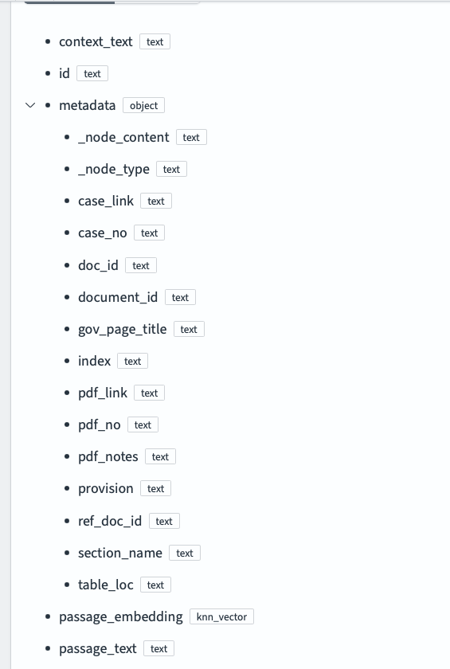
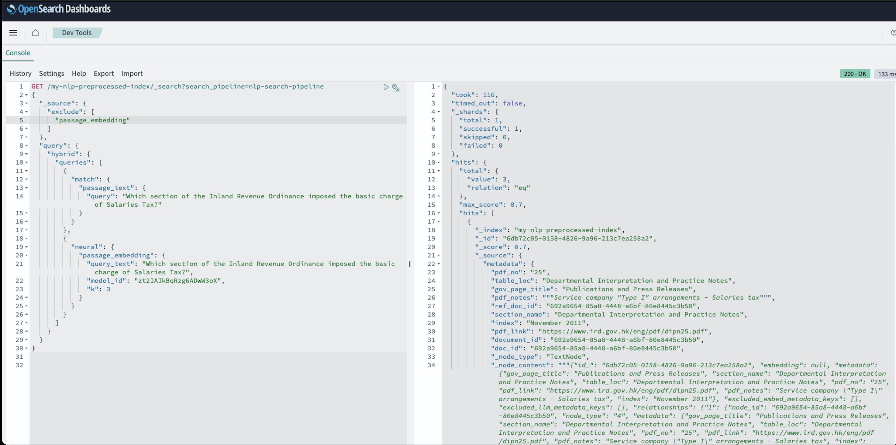

# IRD Data Scientist Test Case

### Objective
Develop a data pipeline to extract, process, and index content from the IRD website (https://www.ird.gov.hk/eng/ppr/arc.htm), along with the first table (No. 1-63) (https://www.ird.gov.hk/eng/ppr/dip.htm). 

The pipeline should leverage vector search within OpenSearch to enable efficient and relevant information retrieval. The goal is to create a structured index that supports both keyword-based and semantic searches.

### setup and installation instruction
1. Start the opensearch local instance with docker/opensearch/docker-compose.yml
In the docker-compose.yml directory, run the following command.
```
docker-compose up
```

2. Create conda environments
- Create python 3.11 conda environment
```
conda create -n timothy_koh_rag python=3.11
```

- Install requirements.txt python package
```
pip install --no-cache-dir -r ./lib/requirements.txt
```

3. Run the following command to export the project directory to PYTHONPATH
```
export PYTHONPATH=.
```

4. Set the yaml files setting
- There are 2 config yaml files in src/config/files. They are original.yaml and preprocessed.yaml. 
    - original.yaml:
        - It uses data/ird_pdfs_md_original markdown files created by docling without preprocessing steps.
    - preprocess.yaml:
        - It uses data/ird_pdfs_md markdown files created by docling with preprocessing steps.

- For the 2 config yaml files, 
    - If you want to run the whole pipeline, set the following in the config yaml file while others remain unchanged.
        - scrape_data: true
        - save_pickle: true
        - load_pickle: false
    - If you want to load the stored src/core/objects/../docs_ird_case.pkl and src/core/objects/../docs_pdf.pkl which are the output in the preprocess_step in pipeline.py, set the following in the config yaml file while others remain unchanged.
        - scrape_data: false
        - save_pickle: false
        - load_pickle: true

5. Run the main.py
- Prequisites:
    - make sure opensearch instances are on
    - make sure created the following items in opensearch
        - model_group_id
        - register a model
        - deploy a model
        - nlp-ingestion-pipeline
        - index
        - nlp-search-pipeline
- run the main.py using original.yaml
```
python src/main.py original
```

- run the main.py using preprocess.yaml
```
python src/main.py preprocessed
```

### Explanation of the data fields, structure, and hierarchy in OpenSearch


There are 5 main parts in the opensearch data fields setting.
1. context_text (str): It is the context of the chunks created from the markdown files
2. id (str): It is the unique id for each chunk
3. metadata (object, dictionary): It is the key-value pairs for storing the information which is useful to describe the data. It includes the following.
    - case_link (str): It refers to the case_link part in the case link(https://www.ird.gov.hk/eng/ppr/arc.htm) about Advance Ruiling Cases
    - case_no (str): It refers to the case_no part in the case link(https://www.ird.gov.hk/eng/ppr/arc.htm) about Advance Ruiling Cases
    - doc_id and document_id (str): They should be the same which refer to the unique id for a chunk. Need to check why it looks like that
    - gov_page_title (str): It refers to the 'Publications and Press Release' in the IRD government webpage
    - section_name (str): It refers to the main title under 'Publications and Press Release' in the IRD government webpage
    - index (str): It refers to the index part in the case link(https://www.ird.gov.hk/eng/ppr/arc.htm) about Advance Ruiling Cases + the date in pdf link(https://www.ird.gov.hk/eng/ppr/dip.htm)
    - provision (str): It refers to the provision part in the case link(https://www.ird.gov.hk/eng/ppr/arc.htm) about Advance Ruiling Cases
    - table_loc: It refers to the header in the case link(https://www.ird.gov.hk/eng/ppr/arc.htm) where can find the table
    - pdf_no: It refers to the pdf_no of the document in pdf link(https://www.ird.gov.hk/eng/ppr/dip.htm)
    - pdf_notes: It refers to the pdf document name in pdf link(https://www.ird.gov.hk/eng/ppr/dip.htm)
    - pdf_link (str): It refers to the pdf link of the document in pdf link(https://www.ird.gov.hk/eng/ppr/dip.htm)
4. passage_embedding (knn_vector): It is the embedding vectors created by lucene for hybrid search
5. passage_text (str): It is the text processed from context_text

### Sample OpenSearch queries and descriptions of how internal links are leveraged in search results


### A sample query output, highlighting the information displayed and demonstrating the relevance of the results




### Reference
1. Setup AWS OpenSearch: https://www.youtube.com/watch?v=BNOYTbRbaFQ
