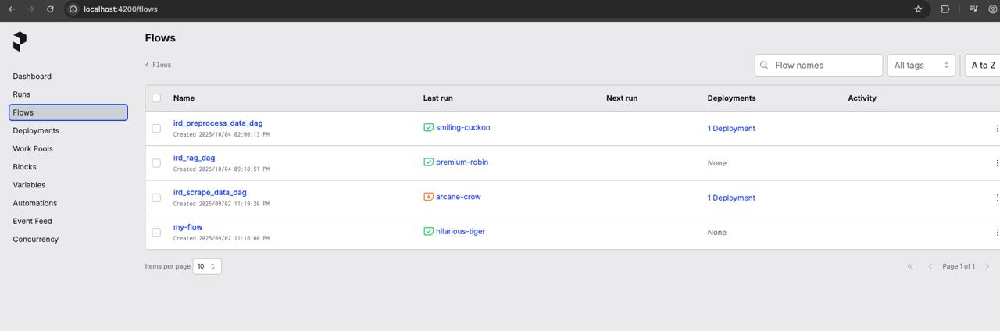
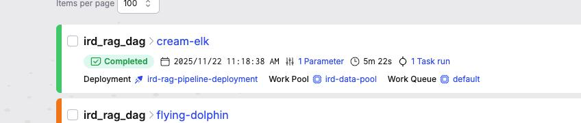

# IRD Data Scientist Test Case

### Objective

It is a github repository for building a pipeline to scrape IRD table data from the iRD website([https://www.ird.gov.hk/eng/ppr/arc.htm](https://www.ird.gov.hk/eng/ppr/arc.htm)), along with the first table (No. 1-63) ([https://www.ird.gov.hk/eng/ppr/dip.htm](https://www.ird.gov.hk/eng/ppr/dip.htm)). Prefect is used as the pipeline orchestrator with 3 main steps. Scrape flow, Preprocess flow and Rag flow. The documents scraped will be stored in a vector db and query with RAG.

Prefect is used as an orchestrator tool to streamline the scraping process in the 2 ird.gov.hk links above automatically. Then the data is passed to preprocess flow to convert the pdf format to markdown then do the cleansing. Human in the loop in needed between pdf files downloaded and cleansing. The quality of the markdown files is extremely important for the vector search Rag flow(Cromadb or opensearch). In this part, docling from IBM is used since it is the best model to convert pdf to markdown comparing to fitz, unstruturedio, etc. Finally, it passes to Rag flow to do the vector search. 

The project is finished in *1 week*.

### setup and installation instruction

1. Start the opensearch local instance with docker/opensearch/docker-compose.yml
   In the docker-compose.yml directory, run the following command.

```
docker-compose up
```

2. Set the .env

- set the environment variables based on .env.template

3. Create conda environments

- Create python 3.11 conda environment

```
conda create -n timothy_koh_rag python=3.11
```

- Install requirements.txt python package

```
pip install --no-cache-dir -r ./lib/requirements.txt
```

4. Run the following command to export the project directory to PYTHONPATH

```
export PYTHONPATH=.
```

5. Set the yaml files setting

- There are 2 config yaml files in src/config/files. They are original.yaml and preprocessed.yaml.

  - original.yaml:
    - It uses data/ird_pdfs_md_original markdown files created by docling without preprocessing steps.
  - preprocess.yaml:
    - It uses data/ird_pdfs_md markdown files created by docling with preprocessing steps.
- For the 2 config yaml files,

  - If you want to run the whole pipeline, set the following in the config yaml file while others remain unchanged.
    - scrape_data: true
    - save_pickle: true
    - load_pickle: false
  - If you want to load the stored src/core/objects/../docs_ird_case.pkl and src/core/objects/../docs_pdf.pkl which are the output in the preprocess_step in pipeline.py, set the following in the config yaml file while others remain unchanged.
    - scrape_data: false
    - save_pickle: false
    - load_pickle: true

6. Build local Docker image

```
docker build -f docker/Dockerfile -t cctongcastiel/ird_data_pipeline_scrape:0.0.1 .
docker push cctongcastiel/ird_data_pipeline_scrape:0.0.1
```

7. Prefect server

- start prefect server

```
prefect server start
```

- start the worker pool

```
prefect worker start --pool "ird-data-pool"
```

- Run deployment

```
prefect deploy
```

An example to run a deployment

```
prefect deployment run 'ird_scrape_data_dag/ird-data-pipeline-deployment'
```

After started the Prefect server, can browse the local host and get the below UI. You can start triggering the workflows.




