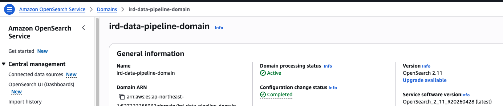
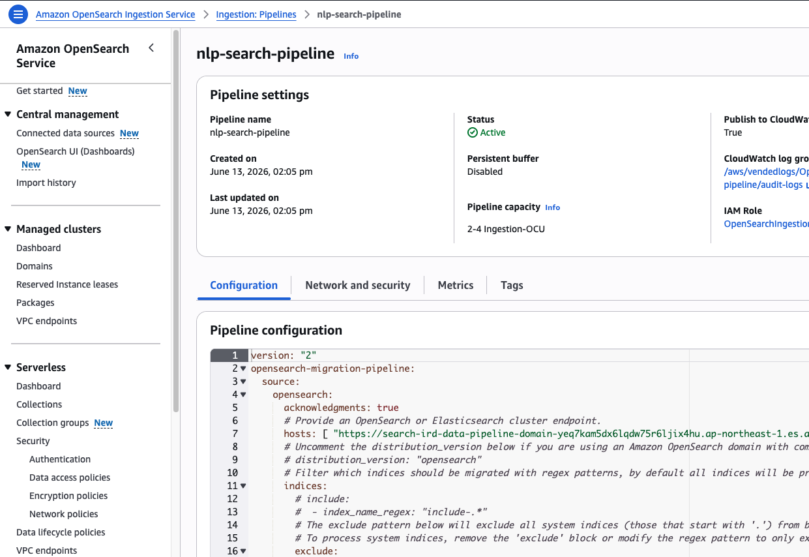
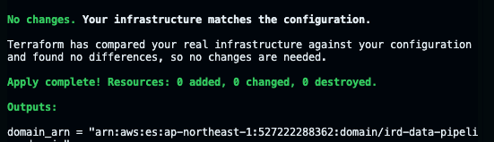

# AWS OpenSearch Provisioning Guide

This document outlines the steps required to provision and destroy the AWS OpenSearch infrastructure using Terraform.

## Prerequisites

Ensure you have the following configured in your environment:
- **AWS Credentials**: Your terminal must be authenticated with an IAM user that has sufficient permissions (e.g., `OpenSearch-Admin-User` created via Terraform).
- **Terraform Installed**: Terraform must be installed and available in your system path.

## Provisioning Steps

Navigate to the infrastructure directory:
```bash
cd infra/terraform
```

### 1. Initialize Terraform
Initialize the working directory, which downloads the necessary AWS providers and modules.
```bash
terraform init
```

### 2. Generate an Execution Plan
Create a plan file named `tfplan`. This step allows you to preview the changes Terraform will make to your AWS resources before they are applied.
```bash
terraform plan -out=tfplan
```

### 3. Apply the Plan
Execute the changes defined in the `tfplan` file to provision the OpenSearch domain.
```bash
terraform apply tfplan
```

## Destruction Steps

To tear down the infrastructure and delete all resources created by this Terraform configuration (including the OpenSearch domain), run:

```bash
terraform destroy
```

**Warning:** Running `terraform destroy` will permanently delete your OpenSearch domain and all data stored within it. Ensure you have backups if necessary.

## Screenshots of successful deployment



